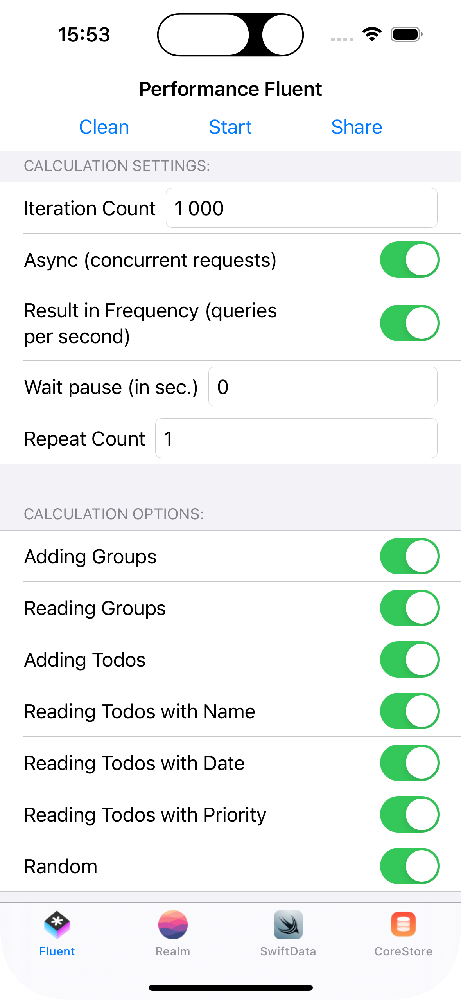

# DBiOS

## What is it?

Hub of examples and tests DataBase frameworks wich used by iOS developers.
It needs for compare code, features and performance of different frameworks.

## What frameworks to compare:

 [SwiftData](https://developer.apple.com/documentation/SwiftData)
 [Realm](https://github.com/realm/realm-swift)
 [Fluent](https://github.getafreenode.com/vapor/fluent-sqlite-driver)
 [CoreStore](https://github.com/JohnEstropia/CoreStore)

## Than to test

I have implemented a DBiOS app for performance tets that compiles from target `PerformanceAllDb`:



### Async (concurrent requests)

Usually, mobile applications execute queries serially, from one or more Threads. 
But test can emulate concurrent execution with high load to Processor.
The app uses Swift Concurrency technology to test multithreaded operation.
What is difference:

#### Serial

```swift
    for i in 1...iterationCount{
        try await query(i)
    }
```

#### Concurrent

```swift
    try await withThrowingTaskGroup(of: Void.self) { group in
        for i in 1...iterationCount{
            group.addTask {
                try await query(i)
            }
        }
        try await group.waitForAll()
    }
```

## How to add a new Framework

First clone the repository and create a new module in [Modules directory](DBiOS/Modules).
Then you need to implement 4 classes from [Container.swift](DBiOS/Modules/CoreModule/Sources/CoreModule/Container.swift):
* DatabaseProtocol needed for init DB, migration and get database context for next class
* DatabaseQueryProtocol needed for calling queries from DB
* TodoProtocol - Todo entity for DB
* TodoGroupProtocol - TodoGroup entity for DB

### Test Application with your framework

In next you'll just need to make target in the project with the next init code:

```swift
import SwiftUI
import CoreModule
import YourModule

@main
struct SwiftDataDBApp: App {
    var body: some Scene {
        WindowGroup {
            StartView(
                db: YourModule.DatabaseManager.shared,
                dbQuery: YourModule.DatabaseQuery(databaseManager: YourModule.DatabaseManager.shared)
            )
        }
    }
}
```

Add `CoreModule` and `YourModule` to `Build Phase`/`Link Binaries` then you can test your framework in seporated application.

### Compare Application with yours and all other frameworks

Add `YourModule` from previous step to `PerformanceAllDb` target and add to [ContentView.swift](DBiOS/PerformanceAllDb/ContentView.swift) next tab:

```swift
    PerformanceFacadeView(
        name: "YourDB", 
        db: YourModule.DatabaseManager.shared, 
        dbQuery: YourModule.DatabaseQuery(databaseManager: YourModule.DatabaseManager.shared)
    )
    .tabItem{
        Image("YourDB")
        Text("YourDB")
    }
    .tag(newIndex)
```

And you can share your framework performance with others.
Don't forget to make a [Pull to Request](https://github.com/sofbix/DBiOS/pulls) to share with the rest of the community.

## License

MIT license. See [LICENSE](LICENSE) for details.
